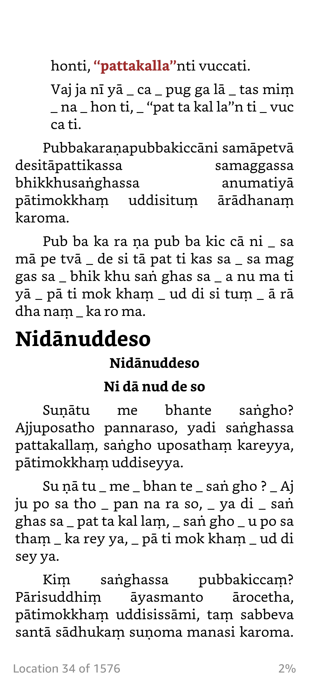

Current version: 0.0.2
Online demo [here](https://huggingface.co/spaces/dpc/palieasyread).


## palieasyread
A quick and simple Python script to split Roman pali words into smaller syllables which are easier to be read.

> Bodhirukkhabodhigharaāsanagharasammuñjaniaṭṭadāruaṭṭavaccakuṭidvārakoṭṭhakapānīyakuṭipānīyamāḷakadantakaṭṭhamāḷakesupi

> [Bo dhi ruk kha bo dhi gha ra ā sa na gha ra sam muñ ja ni aṭ ṭa dā ru aṭ ṭa vac ca ku ṭi dvā ra koṭ ṭha ka pā nī ya ku ṭi pā nī ya mā ḷa ka dan ta kaṭ ṭha mā ḷa ke su pi]

> (from Vinayasaṅgaha-aṭṭhakathā VRI version)

It splits correctly most of the words, but NOT all. Some words may need your postprocessing edit (manually find & replace!).

NOT recommended for beginners who have no idea how to pronounce a pali word. For example `gārayhā`, this script will split it to: `gārayhā => gā ra yhā`, do you know how to pronounce it?

## Usage

### Step 1 Install python3 (if not yet)
Open your device terminal and run:

```bash
python3 --version
```

It will print the current python version installed on your device, something like `Python 3.x.x`.

If not, you need to install or update python. Visit [python](https://www.python.org/downloads/) to download a new one.

### Step 2  download palieasyread

Download [this repository](https://github.com/vpnry/palieasyread/archive/refs/heads/master.zip) and **unzip** it, you will see this standalone app file `palieasyread.py` and `example.txt`.

Copy these 2 files to your convenient folder and from `terminal`, use the command `cd` to go to that folder.

### To convert a pali text file 

For example with `example.txt`, run:

```bash
python3 palieasyread.py example.txt
```

The results will be saved to `example.txt_done.txt` in that same directory.

### To process text right on the terminal 

That standalone app file `palieasyread.py` can be copied anywhere and used as a command line tool or python module.

It also supports text input in terminal:

```bash 

python3 palieasyread.py pubbakaraṇapubbakiccāni samāpetvā desitāpattikassa

```
Output:

```text
pubbakaraṇapubbakiccāni samāpetvā desitāpattikassa
pub ba ka ra ṇa pub ba kic cā ni _ sa mā pe tvā _ de si tā pat ti kas sa

```

### To modify the divider
Open `palieasyread.py` with a code editor like [Visual Studio Code](https://code.visualstudio.com/download), and change these values (near the top of the file) to your needs:

```python
my_word_divider = ' _ '
my_syllable_divider = ' '
my_show_origin = True
```


## More Examples:

### Example 1
Using default settings

```python
my_word_divider = ' _ '
my_syllable_divider = ' '
my_show_origin = True
```

With this text input
```text
Pubbakaraṇapubbakiccāni samāpetvā desitāpattikassa samaggassa bhikkhusaṅghassa anumatiyā pātimokkhaṃ uddisituṃ ārādhanaṃ karoma.

```

Output example 1

```text

Pubbakaraṇapubbakiccāni samāpetvā desitāpattikassa samaggassa bhikkhusaṅghassa anumatiyā pātimokkhaṃ uddisituṃ ārādhanaṃ karoma.

Pub ba ka ra ṇa pub ba kic cā ni _ sa mā pe tvā _ de si tā pat ti kas sa _ sa mag gas sa _ bhik khu saṅ ghas sa _ a nu ma ti yā _ pā ti mok khaṃ _ ud di si tuṃ _ ā rā dha naṃ _ ka ro ma.


```


#### Example 2

Set the word_div to `] [`

```python
my_word_divider = '] ['
my_syllable_divider = ' '
my_show_origin = True
```


With this text input

```text
Manopubbaṅgamā dhammā, manoseṭṭhā manomayā;

Manasā ce paduṭṭhena, bhāsati vā karoti vā;

Tato naṃ dukkhamanveti, cakkaṃva vahato padaṃ.
```

Output example 2

```text

Manopubbaṅgamā dhammā, manoseṭṭhā manomayā;
[Ma no pub baṅ ga mā] [dham mā,] [ma no seṭ ṭhā] [ma no ma yā;]

Manasā ce paduṭṭhena, bhāsati vā karoti vā;
[Ma na sā] [ce] [pa duṭ ṭhe na,] [bhā sa ti] [vā] [ka ro ti] [vā;]

Tato naṃ dukkhamanveti, cakkaṃva vahato padaṃ.
[Ta to] [naṃ] [duk kha man ve ti,] [cak kaṃ va] [va ha to] [pa daṃ.]

```

#### Example 3
Hide the original text (set `my_show_origin=False`), change the word divider to ` / `, and syllable divider to `.`


```python
my_word_divider = ' / '
my_syllable_divider = '.'
my_show_origin = False
```

Output example 3

```text

Ma.no.pub.baṅ.ga.mā / dham.mā, / ma.no.seṭ.ṭhā / ma.no.ma.yā;


Ma.na.sā / ce / pa.duṭ.ṭhe.na, / bhā.sa.ti / vā / ka.ro.ti / vā;


Ta.to / naṃ / duk.kha.man.ve.ti, / cak.kaṃ.va / va.ha.to / pa.daṃ.

```

## Related resources

### Bhikkhupātimokkhapāḷi recitation audio and ebooks


Bhikkhupātimokkhapāḷi ebooks with Pāḷi syllable splitting lines  [https://github.com/vpnry/patimokkha_recitation](https://github.com/vpnry/patimokkha_recitation)




